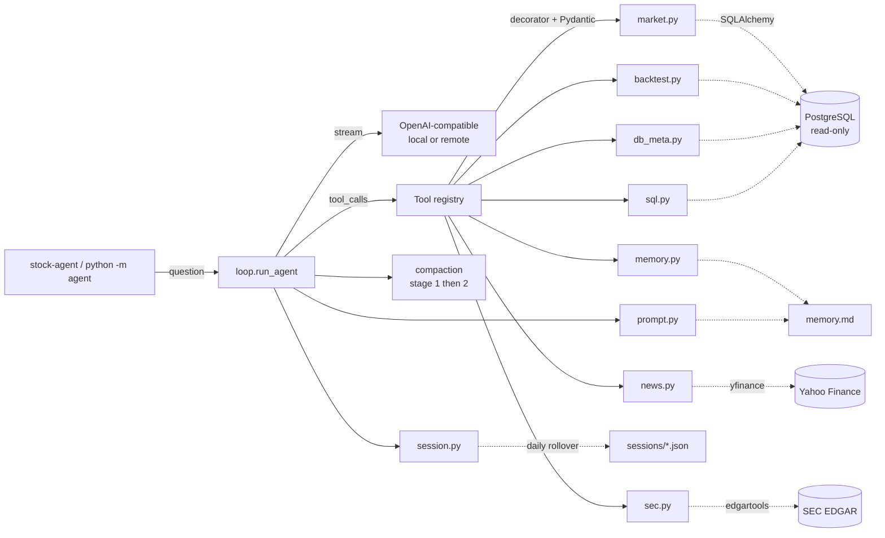

# Stock-Agent

[](https://github.com/nsuderman/Stock-Agent/actions/workflows/ci.yml)
[](https://www.python.org/downloads/)
[](LICENSE)
[](https://github.com/astral-sh/ruff)
[](https://mypy-lang.org/)

Meet **Finn** — a local-LLM ReAct agent that acts as a quantitative stock
research analyst. Finn has tool access to a PostgreSQL stock/backtest
database, Yahoo Finance news, and SEC EDGAR filings. Ask questions in natural
language; Finn plans tool calls, reads the data, and answers concisely. Built
for a local llama.cpp / vLLM server; works with remote OpenAI-compatible
endpoints too.

**One-shot:**
```console
$ stock-agent "what stocks are currently held across my recent backtest runs?"
[iter 1] → get_recent_backtest_holdings(...)

=== ANSWER ===
EGBN and SATL are your highest-conviction cross-strategy signals — held in
28 and 26 of 43 recent backtests respectively...
```

**Interactive REPL** (run `stock-agent` with no question):
```
    ███████╗██╗███╗   ██╗███╗   ██╗
    ██╔════╝██║████╗  ██║████╗  ██║
    █████╗  ██║██╔██╗ ██║██╔██╗ ██║
    ██╔══╝  ██║██║╚██╗██║██║╚██╗██║
    ██║     ██║██║ ╚████║██║ ╚████║
    ╚═╝     ╚═╝╚═╝  ╚═══╝╚═╝  ╚═══╝

    STOCK AGENT · local-LLM quant research assistant
    STATUS: ONLINE  |  MODEL: qwen3.6-35b-a3b  |  SESSION: 2026-04-21

> has anyone at AAPL been selling shares?
```

## Highlights

- **17 typed, validated tools** covering market data, fundamentals, regime
  signals, DTW breakouts, backtest results, Yahoo Finance news, SEC EDGAR
  filings + insider transactions, and a read-only SQL escape hatch.
- **Pydantic argument models** for every tool — OpenAI tool schemas are
  auto-generated; no hand-written JSON to drift out of sync.
- **Interactive REPL** with branded banner, slash commands, readline line
  editing, and session-aware context — or one-shot `stock-agent "question"`.
- **Equalizer-bar spinner** while the stream blocks, then a compact one-line
  tool trace per iteration (`--debug` for full args + result summary).
- **Two-stage auto-compaction** — trims old tool results by summary, then
  falls back to LLM summarization if still over budget. Context-window size is
  probed from `/v1/models` at runtime (llama.cpp `--ctx-size` with alias
  matching).
- **Daily sessions by default** — resumes today's context automatically;
  `--session <name>` pins a longer-running named project.
- **Persistent memory** (`memory.md` by default, or a pluggable `MemoryStore`
  for library use — per-user memory for multi-tenant apps).
- **Embeddable as a library** — `run_agent(...)` accepts a per-call
  `memory_store` and `on_iteration` callback for SSE/WebSocket streaming.
- **Duplicate-call guard** — identical back-to-back tool calls are rejected
  with a synthetic error so ReAct loops can't spin forever.
- **Read-only DB enforcement** at the PostgreSQL session level plus a
  write-keyword regex on `run_sql` — defense in depth.
- **209 tests, 83% coverage**, ruff + mypy clean, CI on Python 3.10/3.11/3.12.

## Architecture



## Setup

```bash
git clone git@github.com:nsuderman/Stock-Agent.git
cd Stock-Agent
python3 -m venv .venv
source .venv/bin/activate
pip install -e ".[dev]"
cp .env.example .env  # then edit with real credentials
pre-commit install     # optional but recommended
```

## Usage

```bash
# Default — resumes today's daily session (sessions/YYYY-MM-DD.json)
stock-agent "how did AAPL perform in Q3 2024?"
stock-agent "and how does that compare to MSFT?"   # remembers previous turn

# Named session for projects that outlive a day
stock-agent --session research "show me NVDA's 2024 return"
stock-agent --session research "and how did it compare to AMD?"
stock-agent --session research --reset "fresh start"

# True one-shot — no session load, no save
stock-agent --no-session "quick question"

# Teach durable facts — written to memory.md, loaded into every future run
stock-agent "remember my universe is EQUITY with market_cap > 1B"

# Other flags
stock-agent --remote "..."            # use remote (Azure) LLM instead of local
stock-agent --quiet "..."             # hide per-tool trace
stock-agent --max-iterations 20 "..." # default is 12
```

If you prefer not to install the console script, `python -m agent "..."` is
equivalent to `stock-agent "..."`.

## Interactive mode

Running `stock-agent` with no question drops into Finn's REPL:

```bash
stock-agent                 # daily session
stock-agent --session deep-dive    # named session
stock-agent --no-session           # ephemeral
stock-agent --debug                # full per-tool trace
```

**Slash commands inside the REPL:**

| Command | Action |
|---|---|
| `/help` | show the slash-command list |
| `/exit`, `/quit` | end the session cleanly |
| `/reset` | clear conversation context (keeps `memory.md`) |
| `/session <name>` | save current, switch to named session |
| `/nosession` | drop to ephemeral mode |

Ctrl-D / Ctrl-C also exit cleanly. Arrow-key history + line editing via
readline where available.

## Configuration

### CLI flags

| Flag | Default | Purpose |
|---|---|---|
| `--session <name>` | today's date (`YYYY-MM-DD`) | Session file to load/save. Override for projects that outlive a day. |
| `--no-session` | off | Skip session I/O entirely (true one-shot). |
| `--reset` | off | Delete the active session file before running. |
| `--remote` | off | Use the remote LLM (Azure) instead of the local server. |
| `--quiet` | off | Hide per-tool trace + compaction messages. |
| `--debug` | off | Show full per-tool trace (args, result summary, iteration headers). |
| `--max-iterations <N>` | 12 | Cap on ReAct loop iterations per invocation. |

### Environment variables (`.env`)

| Variable | Default | Purpose |
|---|---|---|
| `DB_USER`, `DB_PASSWORD`, `DB_HOST`, `DB_NAME` | — | PostgreSQL connection. |
| `DB_SCHEMA` | `stock` | Default search_path for stock.analytics & friends. |
| `BACKTEST_SCHEMA` | `stock` | Schema holding backtest_results / strategies. |
| `LOCAL_LLM_URL` | `http://localhost:8080/v1` | OpenAI-compatible local endpoint. |
| `LOCAL_MODEL` | `qwen3.6-35b-a3b` | Model ID to select on the local server. |
| `LLM_API_KEY` / `LLM_BASE_URL` / `LLM_MODEL` | unset | Remote (Azure) LLM, used when `--remote` is passed. |
| `LOCAL_CONTEXT_WINDOW` | `32768` | Fallback window if `/v1/models` probe fails. |
| `REMOTE_CONTEXT_WINDOW` | `128000` | Same, for `--remote`. |
| `COMPACT_AT` | `0.75` | Compact when input ≥ this fraction of budget. |
| `COMPACT_KEEP_RECENT` | `4` | Last N messages always kept verbatim. |
| `MAX_RESPONSE_TOKENS` | `4096` | Reserved for reply; subtracted from window. |
| `MAX_ITERATIONS` | `12` | Cap on ReAct tool-call rounds per invocation. Overridable per-call via `--max-iterations`. |
| `SEC_USER_AGENT` | `Stock Agent (example@example.com)` | Required by SEC EDGAR fair-use policy. Put your real contact here. |
| `LOG_LEVEL` | `INFO` | Root logger level. |

## Tools

| Tool | Purpose |
|---|---|
| `list_analytics_columns` | List stock.analytics columns + types |
| `describe_table` | Any table's columns + types |
| `sample_rows` | First N rows of any table (useful for JSON shape) |
| `get_price_history` | OHLCV + indicators for one symbol |
| `get_fundamentals` | symbols_info row |
| `get_market_regime` | market_exposure view (day or range) |
| `get_breakouts` | DTW signals via get_live_breakouts() |
| `screen_symbols` | Rank/filter universe by latest analytics + fundamentals |
| `list_backtests` | Recent backtest runs (no heavy payloads) |
| `get_backtest_detail` | Full backtest with downsampled equity curve + capped trades |
| `get_recent_backtest_holdings` | Symbols currently held across N-day window of backtests |
| `list_strategies` | strategies table |
| `get_stock_news` | Recent Yahoo Finance headlines for a ticker |
| `get_recent_filings` | SEC EDGAR filings (10-K/10-Q/8-K/DEF 14A/4/13F) for a ticker |
| `get_insider_transactions` | Form 4 insider buying/selling with share count + price |
| `run_sql` | Read-only SQL escape hatch |
| `remember` | Append a fact to memory.md |

## Testing

```bash
pytest                              # unit tests only (fast)
pytest --cov=agent                  # with coverage
pytest -m integration               # integration tests (hit real DB + LLM)
```

## Evals

```bash
python -m evals                     # run the gold-set against the live LLM
python -m evals --filter breakouts  # one case
python -m evals --json              # machine-readable output
```

See `evals/README.md` for case format and guidance.

## Sessions and memory

- **Default daily session**: without `--session`, the name is today's date
  (`YYYY-MM-DD`). Ask a question, get an answer, follow up — same session.
  Midnight rolls over; yesterday's transcript stays on disk.
- **Named sessions** (`--session aapl-research`) persist across days.
- **`memory.md`** is global for the CLI. Loaded into the system prompt every
  run; appended via the `remember` tool or edited by hand. Library consumers
  can swap in their own `MemoryStore` for per-user memory — see
  [Embedding Finn](#embedding-finn-in-another-python-app).

## Embedding Finn in another Python app

`run_agent` is importable, reentrant, and configurable per call — use it as a
library inside another service (e.g. a FastAPI backend) without forking.

```python
from agent.loop import IterationEvent, run_agent
from agent.memory import MemoryStore


class DbMemoryStore:
    """Two-method protocol: read() -> str, append(fact) -> None."""
    def __init__(self, db, user_id: int):
        self.db, self.user_id = db, user_id

    def read(self) -> str:
        row = self.db.query(UserMemory).filter_by(user_id=self.user_id).one_or_none()
        return row.content if row else ""

    def append(self, fact: str) -> None:
        ...  # upsert into user_memory table


def on_step(event: IterationEvent) -> None:
    # Push per-iteration progress to the frontend via SSE/WebSocket.
    for tc in event.tool_calls:
        send_sse({"tool": tc.name, "args": tc.args, "summary": tc.result_summary})
    if event.final_answer is not None:
        send_sse({"answer": event.final_answer})


answer, messages = run_agent(
    question,
    prior_messages=load_from_db(user_id, session_id),   # your DB, not agent.session
    memory_store=DbMemoryStore(db, user_id),            # per-user isolation
    on_iteration=on_step,                               # streaming progress
    verbose=False,                                      # skip CLI prints
)
save_to_db(user_id, session_id, messages)
```

**Key points for multi-tenant servers:**

- **Sessions** — `agent.session` is CLI-only; store `messages` wherever you
  like, pass via `prior_messages`, persist the returned list.
- **Memory** — implement the `MemoryStore` protocol and pass it per request.
  Binding is via a `ContextVar`, so concurrent async tasks and threads each
  see their own store without locks.
- **Streaming** — `on_iteration` fires once per ReAct step. The terminal
  iteration (no more tool calls) carries `final_answer`; earlier iterations
  carry a list of `ToolCallRecord(name, args, blocked, result, result_summary)`.
- **Defaults preserved** — omit `memory_store` and Finn falls back to
  `FileMemoryStore(Settings.memory_path)` so the standalone CLI is unchanged.

## Known quirks (documented in the system prompt)

- **qwen3.6 emits `<think></think>` blocks** even when empty. The loop strips
  them during streaming and from stored history.
- **`stock.backtest_results.trades` is `json`, not `jsonb`** — use
  `json_array_elements(...)`.
- **`ROUND(double precision, int)` doesn't exist in Postgres** — cast first:
  `ROUND(x::numeric, 2)`.
- **Primary key is `id`, not `backtest_id`** on `stock.backtest_results`.

## Project layout

```
agent/
├── agent/                  # the installable package
│   ├── __init__.py
│   ├── __main__.py         # python -m agent
│   ├── cli.py              # stock-agent entry point
│   ├── loop.py             # ReAct loop + streaming
│   ├── compaction.py       # stage 1/2 compaction + <think> stripping
│   ├── config.py           # Pydantic Settings
│   ├── db.py               # read-only SQLAlchemy engine
│   ├── llm.py              # OpenAI client + /v1/models probe
│   ├── logging_setup.py
│   ├── memory.py           # MemoryStore protocol + FileMemoryStore + contextvar
│   ├── prompt.py           # system prompt builder
│   ├── session.py          # daily/named session persistence (CLI-only)
│   └── tools/              # @tool registry + Pydantic arg models
│       ├── base.py
│       ├── market.py
│       ├── backtest.py
│       ├── db_meta.py
│       ├── memory.py
│       └── sql.py
├── tests/                  # pytest, 158 unit tests
├── evals/                  # gold-set regression harness
├── .github/workflows/ci.yml
├── memory.md               # persistent agent notes (user-owned)
├── sessions/               # runtime conversation state (gitignored)
├── pyproject.toml          # PEP 621; all deps declared here
├── LICENSE                 # MIT
├── CONTRIBUTING.md
└── CLAUDE.md               # guidance for AI assistants working on this repo
```

## License

MIT — see [LICENSE](LICENSE).
