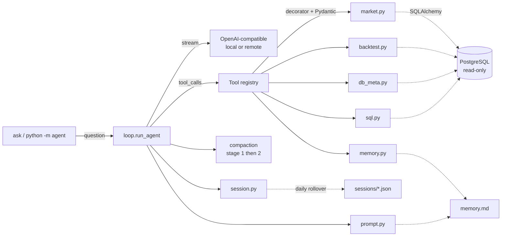

# Agent

[](https://github.com/nsuderman/Stock-Agent/actions/workflows/ci.yml)
[](https://www.python.org/downloads/)
[](LICENSE)
[](https://github.com/astral-sh/ruff)
[](https://mypy-lang.org/)

A local-LLM ReAct agent with tool access to a PostgreSQL stock/backtest
database. Ask questions in natural language; the agent plans tool calls,
reads the data, and answers. Built for a local llama.cpp / vLLM server;
works with remote OpenAI-compatible endpoints too.

```bash
$ ask "what stocks are currently held across my recent backtest runs?"
[iter 1]
  → get_recent_backtest_holdings(...)
    args: {"days_back": 7}
    ← 9 row(s); cols: symbol, n_backtests, n_strategies, strategies, most_recent_run
[iter 2]
  EGBN and SATL are your highest-conviction cross-strategy signals — held in
  28 and 26 of 43 recent backtests respectively...
```

## Highlights

- **14 typed, validated tools** covering market data, fundamentals, regime
  signals, DTW breakouts, backtest results, and a read-only SQL escape hatch.
- **Pydantic argument models** for every tool — OpenAI tool schemas are
  auto-generated; no hand-written JSON to drift out of sync.
- **Streaming** output with live tool-call status so there's no 10-minute
  silence on slow local LLMs.
- **Two-stage auto-compaction** — trims old tool results by summary, then
  falls back to LLM summarization if still over budget. Context-window size is
  probed from `/v1/models` at runtime (llama.cpp `--ctx-size` with alias
  matching).
- **Daily sessions by default** — `ask.py` resumes today's context
  automatically; `--session <name>` pins a longer project.
- **Persistent memory** (`memory.md`) loaded into every system prompt.
- **Duplicate-call guard** — identical back-to-back tool calls are rejected
  with a synthetic error so ReAct loops can't spin forever.
- **Read-only DB enforcement** at the PostgreSQL session level plus a
  write-keyword regex on `run_sql` — defense in depth.
- **158 tests, 87% coverage**, ruff + mypy clean, CI on Python 3.10/3.11/3.12.

## Architecture



## Setup

```bash
git clone git@github.com:nsuderman/Stock-Agent.git
cd Stock-Agent
python3 -m venv .venv
source .venv/bin/activate
pip install -e ".[dev]"
cp .env.example .env  # then edit with real credentials
pre-commit install     # optional but recommended
```

## Usage

```bash
# Default — resumes today's daily session (sessions/YYYY-MM-DD.json)
ask "how did AAPL perform in Q3 2024?"
ask "and how does that compare to MSFT?"   # remembers previous turn

# Named session for projects that outlive a day
ask --session research "show me NVDA's 2024 return"
ask --session research "and how did it compare to AMD?"
ask --session research --reset "fresh start"

# True one-shot — no session load, no save
ask --no-session "quick question"

# Teach durable facts — written to memory.md, loaded into every future run
ask "remember my universe is EQUITY with market_cap > 1B"

# Other flags
ask --remote "..."            # use remote (Azure) LLM instead of local
ask --quiet "..."             # hide per-tool trace
ask --max-iterations 20 "..." # default is 12
```

If you prefer not to install the console script, `python -m agent "..."` is
equivalent to `ask "..."`.

## Configuration

### CLI flags

| Flag | Default | Purpose |
|---|---|---|
| `--session <name>` | today's date (`YYYY-MM-DD`) | Session file to load/save. Override for projects that outlive a day. |
| `--no-session` | off | Skip session I/O entirely (true one-shot). |
| `--reset` | off | Delete the active session file before running. |
| `--remote` | off | Use the remote LLM (Azure) instead of the local server. |
| `--quiet` | off | Hide per-tool trace + compaction messages. |
| `--max-iterations <N>` | 12 | Cap on ReAct loop iterations per invocation. |

### Environment variables (`.env`)

| Variable | Default | Purpose |
|---|---|---|
| `DB_USER`, `DB_PASSWORD`, `DB_HOST`, `DB_NAME` | — | PostgreSQL connection. |
| `DB_SCHEMA` | `stock` | Default search_path for stock.analytics & friends. |
| `BACKTEST_SCHEMA` | `stock` | Schema holding backtest_results / strategies. |
| `LOCAL_LLM_URL` | `http://localhost:8080/v1` | OpenAI-compatible local endpoint. |
| `LOCAL_MODEL` | `qwen3.6-35b-a3b` | Model ID to select on the local server. |
| `LLM_API_KEY` / `LLM_BASE_URL` / `LLM_MODEL` | unset | Remote (Azure) LLM, used when `--remote` is passed. |
| `LOCAL_CONTEXT_WINDOW` | `32768` | Fallback window if `/v1/models` probe fails. |
| `REMOTE_CONTEXT_WINDOW` | `128000` | Same, for `--remote`. |
| `COMPACT_AT` | `0.75` | Compact when input ≥ this fraction of budget. |
| `COMPACT_KEEP_RECENT` | `4` | Last N messages always kept verbatim. |
| `MAX_RESPONSE_TOKENS` | `4096` | Reserved for reply; subtracted from window. |
| `LOG_LEVEL` | `INFO` | Root logger level. |

## Tools

| Tool | Purpose |
|---|---|
| `list_analytics_columns` | List stock.analytics columns + types |
| `describe_table` | Any table's columns + types |
| `sample_rows` | First N rows of any table (useful for JSON shape) |
| `get_price_history` | OHLCV + indicators for one symbol |
| `get_fundamentals` | symbols_info row |
| `get_market_regime` | market_exposure view (day or range) |
| `get_breakouts` | DTW signals via get_live_breakouts() |
| `screen_symbols` | Rank/filter universe by latest analytics + fundamentals |
| `list_backtests` | Recent backtest runs (no heavy payloads) |
| `get_backtest_detail` | Full backtest with downsampled equity curve + capped trades |
| `get_recent_backtest_holdings` | Symbols currently held across N-day window of backtests |
| `list_strategies` | strategies table |
| `run_sql` | Read-only SQL escape hatch |
| `remember` | Append a fact to memory.md |

## Testing

```bash
pytest                              # unit tests only (fast)
pytest --cov=agent                  # with coverage
pytest -m integration               # integration tests (hit real DB + LLM)
```

## Evals

```bash
python -m evals                     # run the gold-set against the live LLM
python -m evals --filter breakouts  # one case
python -m evals --json              # machine-readable output
```

See `evals/README.md` for case format and guidance.

## Sessions and memory

- **Default daily session**: without `--session`, the name is today's date
  (`YYYY-MM-DD`). Ask a question, get an answer, follow up — same session.
  Midnight rolls over; yesterday's transcript stays on disk.
- **Named sessions** (`--session aapl-research`) persist across days.
- **`memory.md`** is global. Loaded into the system prompt every run. Appended
  via the `remember` tool or edited by hand.

## Known quirks (documented in the system prompt)

- **qwen3.6 emits `<think></think>` blocks** even when empty. The loop strips
  them during streaming and from stored history.
- **`stock.backtest_results.trades` is `json`, not `jsonb`** — use
  `json_array_elements(...)`.
- **`ROUND(double precision, int)` doesn't exist in Postgres** — cast first:
  `ROUND(x::numeric, 2)`.
- **Primary key is `id`, not `backtest_id`** on `stock.backtest_results`.

## Project layout

```
agent/
├── agent/                  # the installable package
│   ├── __init__.py
│   ├── __main__.py         # python -m agent
│   ├── cli.py              # ask entry point
│   ├── loop.py             # ReAct loop + streaming
│   ├── compaction.py       # stage 1/2 compaction + ThinkFilter
│   ├── config.py           # Pydantic Settings
│   ├── db.py               # read-only SQLAlchemy engine
│   ├── llm.py              # OpenAI client + /v1/models probe
│   ├── logging_setup.py
│   ├── prompt.py           # system prompt builder
│   ├── session.py          # daily/named session persistence
│   └── tools/              # @tool registry + Pydantic arg models
│       ├── base.py
│       ├── market.py
│       ├── backtest.py
│       ├── db_meta.py
│       ├── memory.py
│       └── sql.py
├── tests/                  # pytest, 158 unit tests
├── evals/                  # gold-set regression harness
├── .github/workflows/ci.yml
├── memory.md               # persistent agent notes (user-owned)
├── sessions/               # runtime conversation state (gitignored)
├── pyproject.toml          # PEP 621; all deps declared here
├── LICENSE                 # MIT
├── CONTRIBUTING.md
└── CLAUDE.md               # guidance for AI assistants working on this repo
```

## License

MIT — see [LICENSE](LICENSE).
